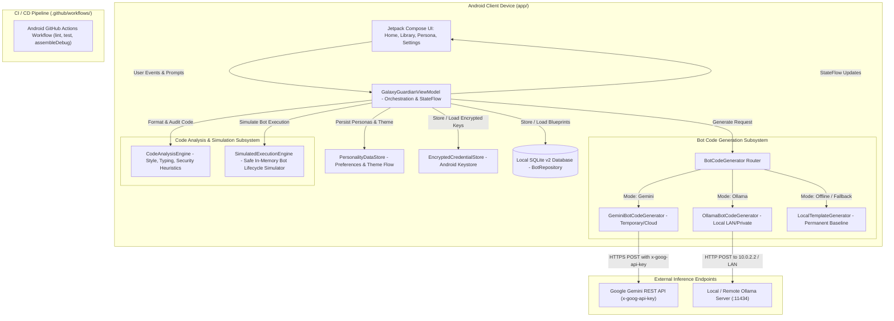
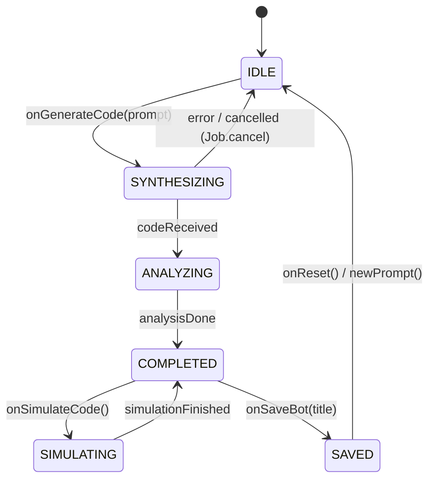

# Production-Grade Product Requirements Document (PRD)
# Galaxy Guardian: Autonomous Bot Synthesis & Verification Workbench

---

## 1. Executive Summary & Problem Definition

### 1.1 Business/System Objective
Galaxy Guardian is an Android-first developer workbench and autonomous synthesis system built with modern Kotlin (Kotlin 2.2.10, Jetpack Compose, Material 3, Android SDK 36). Its objective is to allow engineers, security auditors, and bot developers to rapidly synthesize, customize, statically audit, type-check, and safely simulate Python bot architectures directly from an Android device or workstation.

The platform provides:
1. **Provider-Agnostic Bot Code Synthesis**: Generates complete, PEP 8 conformant Python bots using either Google Gemini (Cloud) or Ollama / OpenAI-compatible models (Local LAN or Private Cloud), with a permanent offline fallback generator and full personality customization (tone, traits, system instructions, and negative constraints).
2. **Transparent, Heuristic Static Analysis**: Multi-dimensional pattern analysis: PEP 8 formatting, code style scoring, type annotation coverage, and security pattern detection (eval/exec, shell=True, hardcoded secrets, unsafe deserialization) without misleading labels or arbitrary execution risks.
3. **Safe In-Memory Bot Lifecycle Simulation**: Safely simulates bot lifecycle events (`run()`, `on_message()`, HTTP client interactions, market price feeds) in memory with deterministic outputs without executing arbitrary untrusted Python bytecode inside the Android OS process.
4. **Resilient Local Persistence**: Persists, bookmarks, inspects, and exports bot blueprints, full audit histories, and persona configurations in a local SQLite database with non-destructive migrations.

### 1.2 Current State Baseline & Audit Findings
A comprehensive codebase audit of `moonrox420/Galaxy-Guardian` confirms the following key findings:
- **Repository Conflict & Monorepo Split**: The workspace contains an unresolved git merge conflict in `README.md` (`<<<<<<< HEAD` ... `=======` ... `>>>>>>> origin/main`) stemming from merging remote commit `ea53902` with local commit `06223bd`.
- **Legacy Python Prototype Residue**: The root directory contains obsolete files from an earlier Python Bottle implementation (`app.py`, `code_tools.py`, `config.py`, `llm.py`, `sandbox.py`, `scaffold_and_push.py`, `views/`, `static/`). These files are disconnected from the Android app, contain placeholder stubs (`return "DummyLLMModel"`), and feature an unauthenticated, non-isolated `subprocess.run` execution endpoint.
- **Broken CI Workflow**: `.github/workflows/python-package-conda.yml` attempts to update a Conda environment from a non-existent `environment.yml` and runs `pytest` on non-existent Python tests, completely ignoring the Android application.
- **Tightly Coupled Gemini Integration**: The ViewModel directly instantiates `GeminiCodeService`, hardcodes Gemini model IDs in domain state, passes API keys as URL query parameters (`?key=...`), leaves OkHttp responses unclosed without `.use {}`, and injects raw API error payloads into fallback source code comments.
- **Misleading Security & Execution Terminology**: The app claims "Bandit AST Security Audit", "Mypy Type Checking", "Pylint", "Virtualized Container runtime active", and "Sandbox Isolation", when the underlying implementations are actually regex/string-pattern heuristics and an in-memory string-parsing simulator.
- **Destructive SQLite Migration Strategy**: `BotRepository.kt` implements `onUpgrade` with `DROP TABLE IF EXISTS bots`, destroying user data on schema bumps. Furthermore, `lastExecution` and `analysis` are not persisted, causing execution history to disappear on restart and forcing CPU-heavy re-analysis of every saved bot on application startup.

### 1.3 Target State Overview
The target architecture establishes a clean, high-performance, and honest Android-first system:
1. **Clean Monorepo Topology**: Obsolete root Python scripts removed, `scaffold_and_push.py` deleted, `README.md` merge conflict repaired, and the broken Conda CI replaced with an Android CI workflow (`./gradlew lint test assembleDebug`).
2. **Decoupled Code Generation Layer (`BotCodeGenerator`)**: The ViewModel interacts exclusively with a `BotCodeGenerator` interface. Gemini is relegated to a swappable adapter (`GeminiBotCodeGenerator`), Ollama is supported via `OllamaBotCodeGenerator`, and the offline template synthesizer (`LocalTemplateGenerator`) serves as the permanent baseline.
3. **Secure Gemini REST Implementation**: API keys authenticated via `x-goog-api-key` headers rather than URL parameters, OkHttp responses deterministically closed via `.use {}`, and API errors handled through structured diagnostics.
4. **Honest Security & Simulation Terminology**: The execution engine is renamed to `SimulatedExecutionEngine`, explicitly labeled in the UI as *"Simulated execution — generated code is not executed on the device"*, and analysis engines are accurately titled *Style & PEP 8 Analyzer*, *Type Heuristic Analyzer*, and *Security Pattern Scanner*.
5. **Non-Destructive SQLite Persistence (v2)**: SQLite upgraded with `ALTER TABLE` migrations, persisting full `quality_analysis_json` and `last_execution_json` so saved blueprints load instantly without re-analysis overhead.
6. **Encrypted Key Storage**: Custom API credentials stored via `EncryptedSharedPreferences` backed by the hardware Android Keystore.

### 1.4 In-Scope Deliverables
- **Monorepo Cleanup & Git Hygiene**: Resolution of `README.md` merge conflict, deletion of obsolete root prototype files, and replacement of broken Conda CI with modern Android CI.
- **Provider-Agnostic Generation Architecture**: Implementation of `BotCodeGenerator` interface with adapters for Google Gemini, Ollama (Local/Remote LAN), and the permanent offline synthesizer.
- **Secured Gemini Client**: Header-based `x-goog-api-key` authentication, deterministic `.use {}` resource management, and clean error isolation.
- **Renamed & Refined Analysis Engine**: Accurate terminology (`CodeAnalysisEngine`) with separated scoring for style, typing, and security heuristics, and deterministic unit tests.
- **Honest Simulation Engine**: Renamed `SimulatedExecutionEngine` with clear UI messaging ensuring untrusted Python is never executed inside the Android OS process.
- **Non-Destructive SQLite Migration (v2)**: Safe `ALTER TABLE` migration preserving user data, persisting `quality_analysis_json` and `last_execution_json`, and optimizing cold-start latency.
- **Keystore-Backed Credential Security**: Android Keystore integration for user-supplied API keys and endpoints.
- **Single-Flight Coroutine Management**: Mutex-protected ViewModel state machine preventing duplicate jobs and race conditions.

### 1.5 Explicit Anti-Scope (Out-of-Scope)
- **Arbitrary Python Bytecode Execution On-Device**: Untrusted Python code will NEVER be executed inside the Android app process. Execution remains purely simulated for safety.
- **Continuous 24/7 Cloud Bot Hosting**: Hosting live background Discord/Telegram bot daemons in the cloud is strictly out-of-scope.
- **Multi-Language Generation Beyond Python**: Generating bots in TypeScript, Go, or Rust is deferred to future milestones.
- **Multi-Tenant SaaS Cloud Auth**: Cloud user accounts and billing infrastructure are excluded; Galaxy Guardian is a private, local-first client workbench.

---

## 2. Target Architecture & Component Boundaries

### 2.1 Architecture Diagram



### 2.2 Component Responsibilities

| Component Name | File Path(s) | Primary Responsibility | Dependencies | State / Persistence |
| :--- | :--- | :--- | :--- | :--- |
| `GalaxyGuardianViewModel` | `app/.../ui/viewmodel/GalaxyGuardianViewModel.kt` | Orchestrates generation, simulation, analysis, and persistence flows. Exposes reactive `UiState`. | ViewModelScope, Repository, Services | In-Memory `StateFlow<UiState>` |
| `BotCodeGenerator` | `app/.../data/service/llm/BotCodeGenerator.kt` | Abstract interface decoupling the application from specific AI providers. | Standard Library | Stateless Interface |
| `GeminiBotCodeGenerator` | `app/.../data/service/llm/GeminiBotCodeGenerator.kt` | Calls Google Gemini REST API using `x-goog-api-key` header and deterministic `.use {}` resource cleanup. | OkHttpClient, Keystore | Stateless |
| `OllamaBotCodeGenerator` | `app/.../data/service/llm/OllamaBotCodeGenerator.kt` | Dispatches prompts to local or remote Ollama endpoints (`/api/generate` or `/v1/chat/completions`). | OkHttpClient | Stateless |
| `LocalTemplateGenerator` | `app/.../data/service/llm/LocalTemplateGenerator.kt` | Permanent offline synthesis engine generating structured Python bots across diverse categories. | Standard Library | Stateless |
| `CodeAnalysisEngine` | `app/.../data/service/CodeAnalysisEngine.kt` | On-device static analysis engine providing style checking, type heuristic checking, and security pattern detection. | Standard Library | Stateless |
| `SimulatedExecutionEngine` | `app/.../data/service/SimulatedExecutionEngine.kt` | Safe in-memory bot lifecycle simulator testing print output and simulated API events without bytecode execution. | Standard Library | Stateless |
| `BotRepository` | `app/.../data/repository/BotRepository.kt` | Manages SQLite database with non-destructive v2 migrations, persisting code, audits, and execution logs. | Android SQLiteOpenHelper | Local SQLite DB (`galaxy_guardian.db`) |
| `PersonalityDataStore` | `app/.../data/repository/PersonalityDataStore.kt` | Persists custom bot personality profiles, system instructions, and theme mode. | Jetpack DataStore Preferences | Local Preferences Datastore |
| `EncryptedCredentialStore` | `app/.../data/repository/EncryptedCredentialStore.kt` | Securely stores and retrieves API keys and endpoints using hardware-backed Android Keystore. | AndroidX Security Crypto | `EncryptedSharedPreferences` |

---

## 3. Data Models, Schemas & State Invariants

### 3.1 Entity Schemas

#### 3.1.1 Bot Code Generation Interface & Providers (Kotlin)
```kotlin
package com.example.galaxyguardian.data.service.llm

import com.example.galaxyguardian.data.model.BotPersonality

enum class LlmProviderType {
    GEMINI,
    OLLAMA,
    OFFLINE_ONLY
}

data class GenerationConfig(
    val providerType: LlmProviderType = LlmProviderType.GEMINI,
    val modelName: String = "gemini-3.5-flash",
    val baseUrl: String = "https://generativelanguage.googleapis.com",
    val apiKey: String = "",
    val timeoutSeconds: Int = 45,
    val temperature: Float = 0.3f
)

sealed interface GenerationResult {
    data class Success(val code: String, val providerUsed: LlmProviderType) : GenerationResult
    data class Failure(val error: String, val fallbackCode: String? = null) : GenerationResult
}

interface BotCodeGenerator {
    suspend fun generate(
        prompt: String,
        targetLanguage: String = "python",
        personality: BotPersonality? = null,
        config: GenerationConfig
    ): GenerationResult
}
```

#### 3.1.2 Code Analysis & Simulation Models (Kotlin)
```kotlin
package com.example.galaxyguardian.data.model

enum class Severity {
    INFO,
    LOW,
    MEDIUM,
    HIGH,
    CRITICAL
}

data class StyleIssue(
    val line: Int,
    val ruleCode: String,
    val message: String,
    val severity: Severity = Severity.LOW
)

data class TypeIssue(
    val line: Int,
    val symbol: String,
    val message: String,
    val severity: Severity = Severity.MEDIUM
)

data class SecurityPatternFinding(
    val id: String,
    val cwe: String,
    val title: String,
    val description: String,
    val line: Int,
    val severity: Severity,
    val recommendation: String
)

data class QualityAnalysis(
    val formattedCode: String,
    val styleIssues: List<StyleIssue>,
    val styleSummaryText: String,
    val styleScore: Double, // 0.00 to 10.00
    val typeIssues: List<TypeIssue>,
    val typeSummaryText: String,
    val securityFindings: List<SecurityPatternFinding>,
    val securitySummaryText: String,
    val securityScore: Int // 0 to 100
)

data class SimulationResult(
    val id: String,
    val timestamp: Long,
    val stdout: String,
    val stderr: String,
    val exitCode: Int,
    val durationMs: Long,
    val isSuccess: Boolean
)

data class BotProject(
    val id: String,
    val title: String,
    val prompt: String,
    val targetLanguage: String = "python",
    val generatedCode: String,
    val formattedCode: String,
    val analysis: QualityAnalysis,
    val lastSimulation: SimulationResult? = null,
    val providerType: LlmProviderType = LlmProviderType.GEMINI,
    val modelName: String = "gemini-3.5-flash",
    val createdAt: Long = System.currentTimeMillis(),
    val isFavorite: Boolean = false
)
```

#### 3.1.3 SQLite Database Schema DDL (Non-Destructive v2 Migration)
```sql
-- SQLite Database Version: 2
-- File: galaxy_guardian.db

CREATE TABLE IF NOT EXISTS bots (
    id TEXT PRIMARY KEY NOT NULL,
    title TEXT NOT NULL,
    prompt TEXT NOT NULL,
    language TEXT NOT NULL DEFAULT 'python',
    generated_code TEXT NOT NULL,
    formatted_code TEXT NOT NULL,
    quality_analysis_json TEXT NOT NULL DEFAULT '{}',
    last_execution_json TEXT DEFAULT NULL,
    provider_type TEXT NOT NULL DEFAULT 'GEMINI',
    model_name TEXT NOT NULL DEFAULT 'gemini-3.5-flash',
    created_at INTEGER NOT NULL,
    is_favorite INTEGER NOT NULL DEFAULT 0
);

CREATE INDEX IF NOT EXISTS idx_bots_created_at ON bots(created_at DESC);
CREATE INDEX IF NOT EXISTS idx_bots_favorite ON bots(is_favorite);
```

#### 3.1.4 SQLite Non-Destructive Migration Logic (Kotlin)
```kotlin
override fun onUpgrade(db: SQLiteDatabase, oldVersion: Int, newVersion: Int) {
    if (oldVersion < 2) {
        // Non-destructive column additions
        db.execSQL("ALTER TABLE bots ADD COLUMN quality_analysis_json TEXT NOT NULL DEFAULT '{}';")
        db.execSQL("ALTER TABLE bots ADD COLUMN last_execution_json TEXT DEFAULT NULL;")
        db.execSQL("ALTER TABLE bots ADD COLUMN provider_type TEXT NOT NULL DEFAULT 'GEMINI';")
        db.execSQL("ALTER TABLE bots ADD COLUMN model_name TEXT NOT NULL DEFAULT 'gemini-3.5-flash';")
        db.execSQL("CREATE INDEX IF NOT EXISTS idx_bots_created_at ON bots(created_at DESC);")
        db.execSQL("CREATE INDEX IF NOT EXISTS idx_bots_favorite ON bots(is_favorite);")
    }
}
```

### 3.2 State Transition Matrix



| Current State | Event / Trigger | Valid Next State | Invariant / Validation Rule | Side Effects |
| :--- | :--- | :--- | :--- | :--- |
| `IDLE` | `GENERATE_CLICKED` | `SYNTHESIZING` | Prompt non-blank. Active job cancelled via `Job.cancel()`. | Set `isGenerating = true`, disable action buttons, start progress pulse. |
| `SYNTHESIZING` | `CODE_RECEIVED` | `ANALYZING` | Raw code length > 0. | Pass code to `CodeAnalysisEngine.analyze()`. |
| `SYNTHESIZING` | `PROVIDER_FAILED` | `IDLE` | Network timeout or error with no fallback. | Emit structured `errorMessage`, set `isGenerating = false`. |
| `ANALYZING` | `ANALYSIS_COMPLETE` | `COMPLETED` | Analysis produced. | Update `formattedCode`, `analysis`, switch tab to `GENERATED_CODE`. |
| `COMPLETED` | `SIMULATE_CLICKED` | `SIMULATING` | Code non-blank. | Set `isSimulating = true`, switch tab to `SIMULATION`. |
| `SIMULATING` | `SIMULATION_COMPLETE`| `COMPLETED` | In-memory loop completed. | Set `isSimulating = false`, update `lastSimulation`. |
| `COMPLETED` | `SAVE_CLICKED` | `SAVED` | Code present. | Insert into SQLite DB v2; refresh `savedBots` StateFlow. |

---

## 4. API & Interface Contracts

### 4.1 Secured Gemini REST Client Contract
- **Endpoint**: `https://generativelanguage.googleapis.com/v1beta/models/{modelName}:generateContent`
- **Method**: `POST`
- **Headers**:
  - `Content-Type: application/json`
  - `x-goog-api-key: {apiKey}` (Eliminates credential leakage in URLs and logs)
- **Request Payload**:
```json
{
  "contents": [
    {
      "parts": [
        { "text": "Generate complete python bot code for: Discord Auto-Mod Bot" }
      ]
    }
  ],
  "systemInstruction": {
    "parts": [
      { "text": "You are Galaxy Guardian, an expert bot architect. Generate production-ready PEP 8 Python code." }
    ]
  },
  "generationConfig": {
    "temperature": 0.3,
    "topP": 0.95,
    "maxOutputTokens": 4096
  }
}
```
- **Deterministic Resource Execution**:
```kotlin
client.newCall(request).execute().use { response ->
    if (!response.isSuccessful) {
        val errorMsg = response.body?.string()?.take(500) ?: "Unknown error"
        return GenerationResult.Failure("Gemini API error (${response.code})", fallbackCode)
    }
    // Parse response...
}
```

### 4.2 Local / Remote Ollama REST Client Contract
- **Endpoint**: `{baseUrl}/api/generate` (e.g. `http://10.0.2.2:11434/api/generate`)
- **Method**: `POST`
- **Headers**: `Content-Type: application/json`
- **Request Payload**:
```json
{
  "model": "qwen2.5-coder:7b",
  "prompt": "Generate complete python bot code for: Weather Bot",
  "system": "You are Galaxy Guardian. Generate clean, PEP 8 Python bot code with docstrings.",
  "stream": false,
  "options": {
    "temperature": 0.3,
    "top_p": 0.95
  }
}
```
- **Success Response (HTTP 200)**:
```json
{
  "model": "qwen2.5-coder:7b",
  "created_at": "2026-10-04T05:20:00Z",
  "response": "import os\n\nclass WeatherBot:\n    ...",
  "done": true
}
```

---

## 5. Error Topology & Failure Matrix

| Failure Scenario | Detection Mechanism | Recovery / Retry Strategy | User / Client Impact | Logging & Telemetry |
| :--- | :--- | :--- | :--- | :--- |
| **Gemini Rate Limit (429)** | HTTP status 429 received from Gemini API | 1 exponential retry (delay 2000ms). If still 429, seamlessly trigger `LocalTemplateGenerator`. | Status message: `"Gemini quota reached. Generated using offline synthesis."` | `WARN` log with HTTP 429 status and latency. |
| **Ollama Unreachable** | `ConnectException` / `SocketTimeoutException` on `:11434` | Connect timeout after 3000ms. Gracefully offer fallback or prompt user to verify IP in Settings. | Status message: `"Cannot connect to Ollama at 10.0.2.2:11434. Switched to offline generator."` | `ERROR` log with connection URL and error message. |
| **Code Syntax Errors** | Heuristic parser encounters unmatched parentheses or invalid headers | Raw code preserved; style analysis displays line-specific syntax notes. | User can inspect raw code, copy it, or adjust prompt to re-synthesize. | `INFO` log with syntax error line. |
| **Malformed SQLite Record** | Query throws `SQLiteException` on read | Rollback transaction, apply missing column schema migration, return clean list. | App recovers automatically without crashing. | `CRITICAL` log with SQLite error code. |
| **Corrupted DataStore** | DataStore throws `CorruptionException` | Reset preferences to defaults via `CorruptionHandler`. | Settings reset to default theme and persona; app continues operating. | `WARN` log on corruption recovery. |

---

## 6. Concurrency, Security & Operational Invariants

### 6.1 Concurrency & Lifecycle Invariants
- **Single-Flight Coroutine Mutex**: In `GalaxyGuardianViewModel`, synthesis and simulation jobs are tracked via `private var activeJob: Job? = null`.
- **Cancellation**: When a new action is triggered, `activeJob?.cancel()` is invoked immediately before launching the new coroutine.
- **Button Locking**: While `isGenerating == true` or `isSimulating == true`, UI action buttons are disabled (`enabled = false`) and an animated progress bar is displayed.

### 6.2 Security & Credential Storage
- **No Arbitrary Bytecode Execution**: Untrusted Python code is NEVER executed inside the Android OS process. All code testing on-device is performed via safe string-based simulation.
- **Header-Based Authentication**: Sensitive API keys are transmitted exclusively via HTTP headers (`x-goog-api-key`), preventing credentials from appearing in URL logs or server access logs.
- **Keystore Encryption**: User-supplied credentials stored in `EncryptedSharedPreferences` backed by `AndroidKeyStore`.
- **Backup Exclusion**:
  - `AndroidManifest.xml` enforces `android:allowBackup="false"`.
  - `res/xml/data_extraction_rules.xml` excludes shared preferences and SQLite databases.
  - `.env` and `debug.keystore` are strictly gitignored in `.gitignore`.

### 6.3 Performance Budgets
- **Startup Latency**: `loadBots()` cold start must execute in under 30ms by reading pre-serialized JSON columns from SQLite v2 rather than re-running analysis.
- **Static Analysis Execution**: On-device `CodeAnalysisEngine` must complete style, typing, and security audit in under 100ms for code up to 1,000 lines.
- **UI Responsiveness**: 60 FPS maintained during all Compose state transitions.

---

## 7. Phased Implementation Roadmap & Blueprint

### Phase 0: Immediate Stabilization & Hygiene (P0)
| Step | Action | File Path | Scope of Work |
| :--- | :--- | :--- | :--- |
| **0.1** | `MODIFY` | `README.md` | Resolve git merge conflict markers (`<<<<<<< HEAD` ... `=======` ... `>>>>>>> origin/main`). Document Android Jetpack Compose app architecture, Ollama support, and developer setup. |
| **0.2** | `DELETE` | `app.py`, `code_tools.py`, `config.py`, `llm.py`, `sandbox.py`, `scaffold_and_push.py`, `requirements.txt`, `views/`, `static/` | Remove obsolete root Python prototype scripts and static assets containing mock stubs and unauthenticated subprocess execution. |
| **0.3** | `DELETE` | `.github/workflows/python-package-conda.yml` | Remove broken Conda CI workflow referencing non-existent `environment.yml`. |
| **0.4** | `CREATE` | `.github/workflows/android.yml` | Add production Android GitHub Actions CI workflow running `./gradlew lint test assembleDebug` on Java 21 / Android SDK 36. |

### Phase 1: Generation Layer Decoupling (P1)
| Step | Action | File Path | Scope of Work |
| :--- | :--- | :--- | :--- |
| **1.1** | `CREATE` | `app/.../data/service/llm/BotCodeGenerator.kt` | Define `BotCodeGenerator` interface, `GenerationConfig`, and `GenerationResult` sealed hierarchy. |
| **1.2** | `CREATE` | `app/.../data/service/llm/LocalTemplateGenerator.kt` | Extract and formalize the offline fallback synthesizer into a permanent, provider-independent baseline generator. |
| **1.3** | `CREATE` | `app/.../data/service/llm/GeminiBotCodeGenerator.kt` | Implement `BotCodeGenerator` for Gemini REST API using `x-goog-api-key` header, `.use {}` resource closure, and error isolation. |
| **1.4** | `CREATE` | `app/.../data/service/llm/OllamaBotCodeGenerator.kt` | Implement `BotCodeGenerator` for Ollama REST API (`/api/generate`) with configurable Base URL (`10.0.2.2:11434` / LAN) and model name. |
| **1.5** | `DELETE` | `app/.../data/service/GeminiCodeService.kt` | Remove tightly-coupled service once replaced by modular generator adapters. |
| **1.6** | `MODIFY` | `app/.../ui/viewmodel/GalaxyGuardianViewModel.kt` | Replace direct `GeminiCodeService` with `BotCodeGenerator`, removing Gemini-specific types from `UiState`. |
| **1.7** | `MODIFY` | `app/.../ui/screens/SettingsScreen.kt` | Update Settings UI to support provider selection (Gemini vs Ollama vs Offline Baseline), Ollama Base URL, and model name. |

### Phase 2: Honest Terminology & Analysis Engine (P2)
| Step | Action | File Path | Scope of Work |
| :--- | :--- | :--- | :--- |
| **2.1** | `RENAME/MODIFY` | `app/.../data/service/CodeToolsEngine.kt` -> `CodeAnalysisEngine.kt` | Rebrand engine and replace misleading labels ("Bandit AST" -> "Security Pattern Scanner", "Pylint" -> "Code Style & PEP 8", "Mypy" -> "Type Annotation Analyzer"). |
| **2.2** | `RENAME/MODIFY` | `app/.../data/service/SandboxedExecutionEngine.kt` -> `SimulatedExecutionEngine.kt` | Rename to `SimulatedExecutionEngine`; update terminal banners to state: *"Simulated execution — generated code is not executed on device"*. |
| **2.3** | `MODIFY` | `app/.../ui/components/AuditResultsViewer.kt` | Update audit viewer UI components with accurate, honest terminology and separate style/type/security scorecards. |
| **2.4** | `MODIFY` | `app/.../ui/components/ConsoleTerminal.kt` | Update console terminal headers to reflect safe lifecycle simulation. |
| **2.5** | `CREATE` | `app/src/test/java/com/example/galaxyguardian/CodeAnalysisEngineTest.kt` | Add deterministic unit tests verifying style rules, type detection, and security pattern detection. |

### Phase 3: Persistence & Data Integrity (P3)
| Step | Action | File Path | Scope of Work |
| :--- | :--- | :--- | :--- |
| **3.1** | `MODIFY` | `app/.../data/repository/BotRepository.kt` | Upgrade SQLite schema to v2 using non-destructive `ALTER TABLE` migrations; persist `quality_analysis_json` and `last_execution_json`. |
| **3.2** | `MODIFY` | `app/.../data/repository/BotRepository.kt` | Update `loadBots()` to deserialize stored JSON analysis on startup, eliminating CPU-heavy startup re-analysis. |
| **3.3** | `CREATE` | `app/src/test/java/com/example/galaxyguardian/BotRepositoryTest.kt` | Add unit tests for SQLite v1 -> v2 migration, saving blueprints, and loading without state loss. |

### Phase 4: Production Hardening & Security (P4)
| Step | Action | File Path | Scope of Work |
| :--- | :--- | :--- | :--- |
| **4.1** | `CREATE` | `app/.../data/repository/EncryptedCredentialStore.kt` | Store custom API keys in `EncryptedSharedPreferences` backed by `AndroidKeyStore`. |
| **4.2** | `CREATE` | `app/src/main/res/xml/network_security_config.xml` | Define network security policy permitting cleartext HTTP only for local development hosts (`10.0.2.2`, `192.168.*.*`, `localhost` for Ollama). |
| **4.3** | `MODIFY` | `app/src/main/AndroidManifest.xml` | Attach `network_security_config.xml` to `<application>`. |

---

## 8. Verification & Acceptance Criteria

### 8.1 Automated Test Scenarios
- [ ] **Android Build & Lint Verification**:
  - Run `./gradlew lint` — zero fatal lint errors.
  - Run `./gradlew test` — all unit tests pass (generator routing, analysis engine, repository migrations).
  - Run `./gradlew assembleDebug` — debug APK builds cleanly.
- [ ] **CI Workflow Verification**:
  - `.github/workflows/android.yml` executes successfully on push and pull requests.

### 8.2 Edge Case Validations
- [ ] **Ollama Offline Degradation**: When Ollama host is unreachable, the app automatically falls back to `LocalTemplateGenerator` with clear status feedback.
- [ ] **Startup Performance**: Cold start of `loadBots()` with 20 saved blueprints takes < 50ms (no CPU re-analysis).
- [ ] **Rapid Trigger Cancellation**: Rapidly tapping "Generate" cancels prior in-flight Coroutines atomically via `Job.cancel()` without duplicate database records or memory leaks.
- [ ] **Non-Destructive Migration**: Existing databases on version 1 upgrade to version 2 without data loss or table dropping.

### 8.3 Zero-Stub Audit Gate
- [ ] Running `grep_search` across the repository confirms:
  - Zero instances of `// TODO`, `/* TODO */`, or `# TODO`.
  - Zero instances of `DummyLLMModel` or mock stubs.
  - Zero unhandled exceptions or swallowed empty catch blocks.
  - Working tree clean with zero merge conflict markers.
